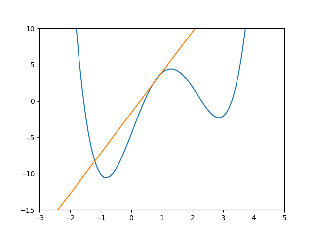

.. _mathematical_analysis:

Mathematical Analysis
=====================
Mathematical analysis is done to find (i.e. solve for) the following:

1. **Roots**: Find *x* at *f(x)* = 0 or *f(x)* - *c(x)* = 0.
2. **Optimals**: Find both *x* and *f(x)* at minima and maxima.
3. **Derivatives**: Find the slope of *f(x)* at a location *x*.
4. **Integrals**: Find the area under *f(x)* between *x* = *a* and *x* = *b*.

All four analyses are solved using the ``scipy`` package, which uses the ``from ... import ...`` format.

.. nbplot::

    >>> import matplotlib.pyplot as plt
    >>> import numpy as np
    >>> from scipy import optimize
    >>> from scipy import misc
    >>> from scipy import integrate
  

Consider for example the following mathematical function

.. math::

    f(x) = 0.9x^4 - 4x^3 + 0.5x^2 + 11x - 4.5

This function is defined and plotted in Python like this:

.. nbplot::

    >>> def f(x):
    ...     return  0.9 * x**4 - 4 * x**3 + 0.5 * x**2 + 11 * x - 4.5
    ...
    ...
    >>> x = np.arange(-10, 10, 0.1)
    >>> y = []
    >>> for i in x:
    ...     result = f(i)
    ...     y.append(result)
    ...
    >>> plt.figure(1)
    >>> plt.plot(x, y)
    >>> plt.xlim(-3, 5)
    >>> plt.ylim(-15, 10)
    >>> plt.show()

Imagine this function is a mathematical model representing something in the real world (e.g.imagine *x* is the electricity input into a motor, and *y* is the resulting speed output). 
Mathematical analysis is done to find a 1) root, or 2) minimum, or 3) slope, or 4) area under the curve for this model. 

The ``scipy`` package uses **iterative methods** for mathematical analysis (i.e. not symbolic methods like you learn in a math class). Consequently, the solutions
are only *approximations*, with *error*. The underlying algorithms are sophisticated procedures that have been developed
by brilliant computer scientists and mathematicians (some of which have been in development for hundreds of years). 
Iterative alorithms are also called **numerical methods** because they involve interaring over numbers. There are 
many different numerical methods described in the ``scipy`` documentation. On a basic level, you can think of these algorithms as a series of ``for`` loops and ``if`` statements that iteratively crank out hundreds of calculations to "search" for an answer.
An algorithm terminates when it "converges" to a certain limit of approximation.

(Other relevant pages: `Defining Functions <functions.html>`_, `Creating Plots <creating_plots.html#plot>`_, and `Import Modules <python_essentials.html#import-modules>`_).

Finding Roots (Solver)
----------------------
By inspection of the plot it appears ``f(x)`` has four roots. A root is the x-intercept, in other words, the location
where ``f(x) = 0`` (The word root comes from the idea that a plant grows up from its roots and the x-axis is like the
ground). Without inspecting a plot or having some other knowledge it is not possible to know how many roots a function has. For
polynomial functions, the order of the highest exponent, in this case 4, is equal to the number of *possible* roots.
Thus, ``f(x) = x**3 ...`` will have 3 or fewer roots and ``f(x) = x**8 ...`` will have 8 or few roots. Furthermore,
an even number exponent will have an even number of roots and an odd degree polynomial will have an odd number of roots.

Use ``axhline`` to add a horizontal like to a plot. In this case, we want a horizontal line at ``y=0``. Zoom into
the figure to visually identify the roots (Read the `tip about popup windows in Creating Plots <creating_plots.html#popup-tip>`_ for
zoom in/out instructions.)

.. nbplot::
    :nofigs:

    >>> plt.axhline(y=0, color='k')

.. image:: images/root-figure.png

To find a root we must provide an initial guess that will be the starting point for the ``scipy`` algorithm to search. 
Let's find the root near ``x = -2`` first.

    >>> # Example finding roots.
    >>> result = optimize.root(f, -2)
    ...
    >>> print(result)
        fjac: array([[-1.]])
         fun: array([-3.55271368e-15])
     message: 'The solution converged.'
        nfev: 9
         qtf: array([-2.20458318e-09])
           r: array([33.28953419])
      status: 1
     success: True
           x: array([-1.55782277])

The output is explained in the documentation; it says `scipy.optimize.root <https://docs.scipy.org/doc/scipy/reference/generated/scipy.optimize.root.html>`_ 
returns a "OptimizeResult" object. The important attribute of the object is ``x``, the solution as a numpy array. 
Printing the result object above revealed all the attributes, including ``x``. Here forward, we will only print the ``x`` attribute (See `Class and Object <data_types.html#class-and-object>`_).
Furthermore, if the input argument is a sequence of values, then the result will be an array of multiple roots.

Let's find all the roots that are near -2, 0.5, 2, and 3.

    >>> result = optimize.root(f, [-2, 0.5, 2, 4])
    >>> print(result.x)
    [-1.55782281  0.42629992  2.29415865  3.28180865]

.. tip::
    The result is a numpy array, so you can use ``np.round`` to round all the elements at the same time. 
    (See Tip box under `Defining Mathematical Functions <functions.html#mathematical-functions>`_ for more numpy shortcuts.)
    
    .. code::
    
        >>> solution = np.round(result.x, 2)
        >>> print(solution)
        [-1.56  0.43  2.29  3.28]
        

We can also use ``optimize.root`` to find *x* at other values such *f(x)* = *c* or *f(x)* = *c(x)*. For example, suppose we want to solve:

.. math::

    0.9x^4 - 4x^3 + 0.5x^2 + 11x - 4.5 = 7

The first step is to get a sense of how many solutions there might be. The same principals apply to finding roots. 
We can investigate visually by adding adding the right hand side to the plot. In this example the right hand side is a constant, 
so we add a horizontal line at ``y=7``.

.. nbplot::
    :nofigs:

    >>> plt.axhline(y=7, color='r')

.. image:: images/root-at-7.png

It appears there are solutions near -2 and 3.

The next step is to transform the function by setting it equal to zero. The new function ``f2`` can now be solved for its roots near the initial guess values -2 and 3.

    >>> # Example using a transformed function to solve for x.
    ...
    ...
    >>> def f2(x):
    ...     return f(x) - 7
    ...
    ...
    >>> result = optimize.root(f2, [-2, 3])
    >>> print(result.x)
    [-1.73573581  3.63147902]

Finding Minima/Maxima (Optimization)
------------------------------------
To find a minima and maxima we must provide an initial guess that will be the starting point for the ``scipy``
algorithm to search. By inspection of the plot it appears there is a minimum near ``x = -1`` (In fact, the
plot shows it is the global minimum).

    >>> # Example finding minimum.
    >>> result = optimize.minimize(f, -1)
    ...
    >>> print(result)
          fun: -10.57170310882053
     hess_inv: array([[0.03556876]])
          jac: array([1.1920929e-07])
      message: 'Optimization terminated successfully.'
         nfev: 18
          nit: 4
         njev: 6
       status: 0
      success: True
            x: array([-0.82450405])

The documentation for `scipy.optimize.minimize <https://docs.scipy.org/doc/scipy/reference/generated/scipy.optimize.minimize.html>`_
says it returns a "OptimizeResult" object. The important attributes of the object are ``fun``, the value of the minimum
that was found, and ``x``, the location of the minimum. Here forward, we will only print those attributes
from the object (See `Class and Object <data_types.html#class-and-object>`_). The result attribute ``x`` is a numpy array, but
we there is only one item, so we will print ``x[0]`` (Unlike root, it is not possible to solve multiple arguments at once).

There is another minimum (a local minimum) near ``x = 3``.

    >>> result = optimize.minimize(f, 3)
    ...
    >>> print("Minimum = ", result.fun)
    >>> print("at location x = ", result.x[0])
    Minimum =  -2.309700223712568
    at location x =  2.86375715

By inspection of the plot the global maximum is infinity at x = -infinity and x = infinity. There also
appears to be a local maximum near ``x = 1``. Note the ``scipy`` function explicitly finds the *minimum*. Consequently,
to find a maximum we need to write a new function that negates the original function (effectively turning it upside
down). For example we define a new function ``f2``. Next we run the ``scipy`` search algorithm on the new function ``f2`` 
and remember to **negate** the ``fun`` attribute of the result object.

    >>> # Example finding maximum using a transformed function.
    ...
    ...
    >>> def f2(x):
    ...     return  -f(x)
    ...
    ...
    >>> result = optimize.minimize(f2, 1)
    ...
    >>> print("Maximum = ", -result.fun)
    >>> print("at x location ", result.x[0])
    Maximum =  4.42769962882684
    at x location  1.29407959

.. comments
    TODO: Add example with constraints. and an example with x1 and x2 decision variables.

.. note::
    The examples above find *local* minima/maxima near an initial guess for *smooth*, *continuous*, *convex/concave*
    functions. ``scipy`` has other optimization methods for other situations. For example, ``scipy.optimize.differential_evolution``
    will find *global* minima/maxima and can be used on *non-smooth* functions.

Finding the Slope (Derivatives)
-------------------------------
It seems finding derivatives was an after thought for the people at ``scipy`` because they put it in their "miscellaneous"
module. ``misc.derivative`` uses an `iterative method <https://en.wikipedia.org/wiki/Finite_difference#finite_difference_approximation>`_  
with precision dependent on the parameter ``dx``. For illustration,
let's find the slope (derivative) of ``f(x)`` at ``x = 0.7``, which is written symbolically in two different ways:

.. math::

    \begin{align*}
    & f' (0.7) \\
    \text{or} \\
    & \frac{dy}{dx} \vert_{0.7} \\
    \end{align*}

.. nbplot::

    >>> # Example finding the slope.
    >>> result = misc.derivative(f, 0.7, dx=0.0000001)
    >>> print(result)
    7.054799997519012

The documentation for `scipy.misc.derivative <https://docs.scipy.org/doc/scipy/reference/generated/scipy.misc.derivative.html>`_
says the keyword parameter ``dx`` is the spacing, with smaller spacing producing better results. 

A tangent line can be added to the plot using the following function

    >>> def tangent_line(f, x_values, tangent_location):
    ...     """Returns points along a line tangent to a function.
    ...
    ...         Args:
    ...             f: A function.
    ...             x_values: Numpy array of x values for the tangent line. 
    ...             tanget_location: x location.    
    ...     """
    ...     slope = misc.derivative(f, tangent_location)
    ...     points_along_tangent = slope * (x_values - tangent_location) + f(tangent_location)
    ...     return points_along_tangent 
    ...
    ...
    >>> x = np.arange(-10, 10, 0.1)
    >>> y = f(x)
    >>> plt.figure(2)
    >>> plt.plot(x, y)
    >>> tangent_points = tangent_line(f, x, 0.7)
    >>> plt.plot(x, tangent_points)
    >>> plt.xlim(-3, 5)
    >>> plt.ylim(-15, 10)

We can verify that the slope at at a minimum location is zero (well approximately zero). 
Lets first find the global minimum near ``x = -1.5`` and then find the slope at that minimum location.

    >>> result = optimize.minimize(f, -1.5)
    >>> min_location = result.x[0]
    >>> slope = misc.derivative(f, min_location, dx=0.0000001)
    >>> print(slope)
    -2.398081733190338e-07

To find higher order derivatives, then include the parameter ``n``. For example, the 2nd order derivative at the minimum location is:

    >>> result = misc.derivative(f, min_location, dx=0.0000001, n=2)
    ...
    >>> print(result)
    29.93001234401565

Finding Area Under a Curve (Integration)
----------------------------------------
There are variouis numeric methods to approximate an integral. These include `Simpson's Rule <https://en.wikipedia.org/wiki/Simpson%27s_rule>`_, 
`Trapezoidal Rule <https://en.wikipedia.org/wiki/Trapezoidal_rule>`_, and 
`Quadrature <https://en.wikipedia.org/wiki/Gaussian_quadrature>`_. Through these methods the integral is approximated by dividing the area 
under the curve into shapes and summing each shape area in what is called a `Riemann's Sum <https://en.wikipedia.org/wiki/Riemann_sum>`_. 

All of these methods are available with ``scipy``. The preferred method is quadrature. 
Consider for example, finding the area under *f(x)* from 0.5 to 2.5, , which is written symbolically like this:

.. math::

    \int_{0.5}^{2.5} f(x) dx
 
.. nbplot::
   

    >>> # Example finding the area under a curve (integral).
    >>> result = integrate.quad(f, 0.5, 2.5)
    ...
    >>> print(result)
    (5.155833333333335, 6.008597318532352e-14)

The documentation for `scipy.integrate.quad <https://docs.scipy.org/doc/scipy/reference/generated/scipy.integrate.quad.html>`_
says the basic output includes two items: the integral and an estimate of the error.

.. comments
    TODO: Area between two curves.
    TODO: np.polyfit()

Sometimes we might have *x* and *y* values but we don't know the functional form of *f(x)*. For example, 
suppose measurements were recorded in a laboratory for the *y* values that correspond to certain *x* values. 
We can plot the data to see an approximation of the curve.

.. nbplot::

    >>> # Data recorded as field observations.
    >>> x = [2, 3, 4, 5, 6]
    >>> y = [44, 57, 61, 53, 30]
    ...
    >>> # Plot of observed data.
    >>> plt.figure(3)
    >>> plt.plot(x, y, marker='o')
    >>> plt.xlim(0, 7)
    >>> plt.ylim(0, 70)
    >>> plt.show()

In this situations we need to use one of the other numerical integration methods. The preferred method is Simpson's rule.
    
    >>> # Example finding the area under points when f(x) is  not known. 
    >>> result = integrate.simps(y, x)
    ...
    >>> print(result)
    212.0

.. note::
    The methods described on this webpage are *numeric methods*, which means they use iterative algorithms 
    to search over numeric calculations to find an approximate solution. Alternatively, there is a Python package that can do 
    symbolic mathematics called ``sympy``.  

.. comments
    TODO: Area between two curves.
    TODO: np.polyfit()

