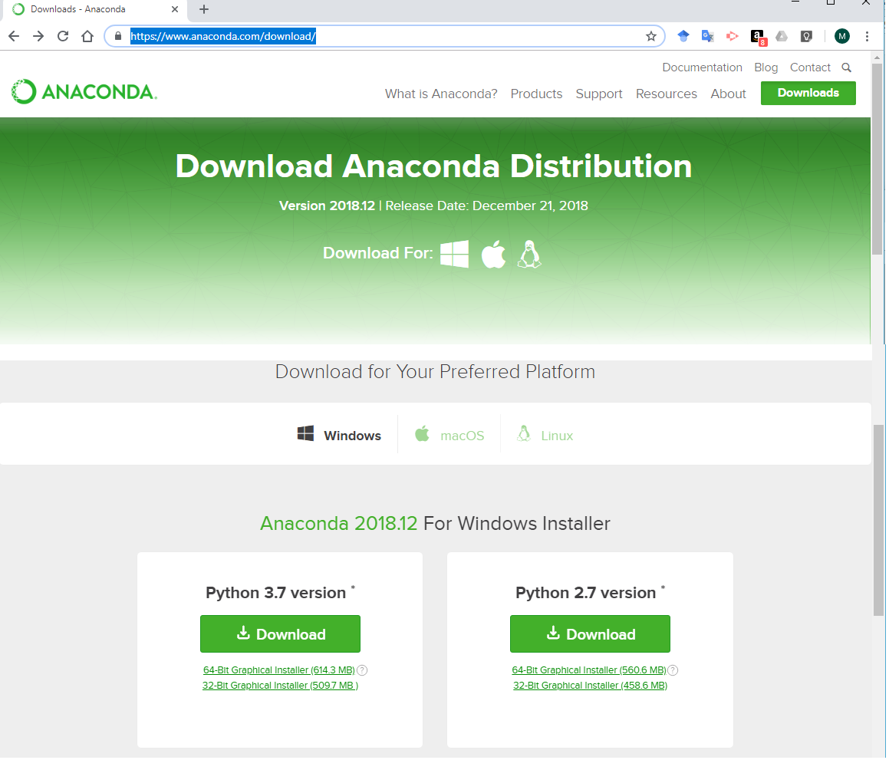
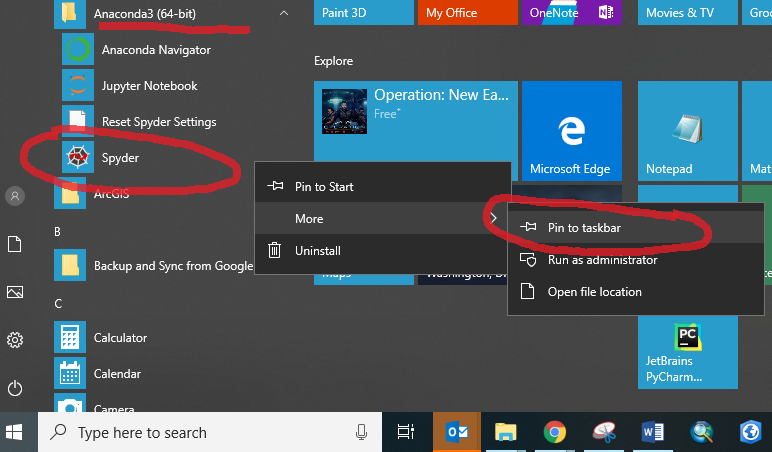

.. _setup_instructions:

Setup and Getting Started
=========================

Why Python?
-----------
Civil engineers can do most of their work with a calculator, Excel, and specialized software, but sometimes \
analysis and design requires custom computer programming. Right now, and for the near future, most experts agree \
that Python is the best programming language to learn for a wide variety of analysis and design tasks.

Python is...

- one of the easiest computer languages to learn (and can be a stepping stone for other languages),
- very fast and powerful for data analysis and engineering design problems,
- easy to share and collaborate with team members,
- used by most big tech companies, including Google, Facebook, and Netflix,
- easily integrated with other software, including Excel, ArcGIS, and VISSIM, and
- has thousands of extra "packages" that people are continually improving and providing for free on the internet.

If you do a Google search for best computer languages, you will find that most experts rank Python as number one or \
least in the top five. For example, here are the rankings from IEEE (Institute of Electrical and Electronics Engineers):
`Top Programming Languages. <https://spectrum.ieee.org/static/interactive-the-top-programming-languages-2018>`_
(Note on the IEEE page you can change the rankings based on various aspects, including the number of jobs available.)

What is Python?
---------------
There are lots and lots of computer languages. New languages are being created by smart computer scientists every year. \
The first "modern" language is simply called "*C*". The reason is because in 1972 the guys at Bell Labs that invented it \
had previously created a language that they called "*A*" and then they created something better that they called "*B*". \
When they got to "*C*" it was so good they \
stopped trying to improve it. *C* became the main programming language for many years and continues to be a leading language.

Improvements were eventually made to *C* and became distinct languages such as *C++* and *C#*. Other languages are Fortran, Java, PHP, R, GO, and Pearl.

=========================== =======================================================
Programming Method          Characteristics
=========================== =======================================================
Procedural programming      follows a procedure (also called a routine or a script)
Functional programming      can call functions stored in other parts of the code
Declarative programming     can efficiently query databases
Object-oriented programming uses objects called classes
=========================== =======================================================

How do I install it?
--------------------
There are many versions of Python, many ways to install it, and many many add-in extra "modules" or "packages" \
(also called libraries in other computer languages) that can be additionally installed.

Save yourself a lot of headache and simply install the "Anaconda Distribution" with the lastest version of Python.
The Anaconda installation will include all the best packages, a great code editor called Spyder, and other tools for easily \
adding and updating packages.

`https://www.anaconda.com/download <https://www.anaconda.com/download/>`_

.. note:: There were significant changes from Python version 2.7 to Python 3. Consequently, the Anaconda people still \
    make Python 2.7 available for legacy applications that some people might still be using. You should install the newest version, \
    which is currently Python 3.7.

How do I get started?
---------------------
There are many ways to interact with Python once it has been installed. The best way is to use an IDE (Integrated Development Environment) such as \
Spyder, IDLE, or PyCharm. The Anaconda Distribution includes Spyder.

I recommend you pin Spyder to your taskbar for easy access. Naviagate to the Anaconda folder, right click on the Spyder \
program, click More, and click Pin to taskbar.

When you first open Spyder it should look something like the image shown below. The layout in Spyder is completely customizable, \
which means you can close, open, and rearrange the windows how you please. I recommend keeping the default layout with \
the three windows (calle panes) shown below.

.. image:: images/spyder-open.jpg

The first window pane is the Editor where you will type code that can be saved and used later.
The second window pane is the Console where you can also type code, but it is not saved. Code written in the Editor and code \
written in the Console is output to the Console. The Console is also called the Interpreter.
The third window pane is a good place to read help files or to explore data that has been read into the system. This is window \
might not be useful so could be closed.

I recommend that today and throughout your learning that you explore the Spyder GUI (graphical user interface), \
i.e. close and move windows, push different buttons and menus, etc. Don't worry, you won't break it. And you can always \
put everything back to normal by going to Tools/Reset Spyder to factory defaults. For example, some people like to have \
certain panes on or off, which can be done at View/Panes.

Write your first computer program
---------------------------------
Begin by typing in the Console a = 5. Hit enter.
Now type b = 6 and hit enter again.

The variables a and b are now stored in your computer. You can see this by looking at the Variable explorer in the upper \
right pane. Now type a + b and hit enter to see how Python can be used as calculator.

.. image:: images/variable-explorer.png

.. note::
    The Spyder console uses a format called IPython that looks like this:

    .. image:: images/ipython-prompt.png

    The IPython input prompt is In [ ] and numbered consecutively. Likewise, output is preceded with Out [ ] and the corresponding number.

    The original Python prompt, which can be seen if you use IDLE to write code, uses three arrows >>> for input. Like this:

    .. image:: images/idle-prompt.png

"The" official Python Tutorial begins its introduction by showing how the Console (also called the Interpreter) can be used as a calculator.
See `An Informal Introduction to Python <https://docs.python.org/3.7/tutorial/introduction.html>`_

Indeed the Console can be useful for quick calculations or to check output. But for long procedures (i.e. multiple calculations in a sequence) \
it is better to use the Editor. The Editor allows you to save the code as a "script" and re-run the script later. Furthermore, if you only use the Console, then once you \
close Spyder all the variables will be lost.

.. code-links::